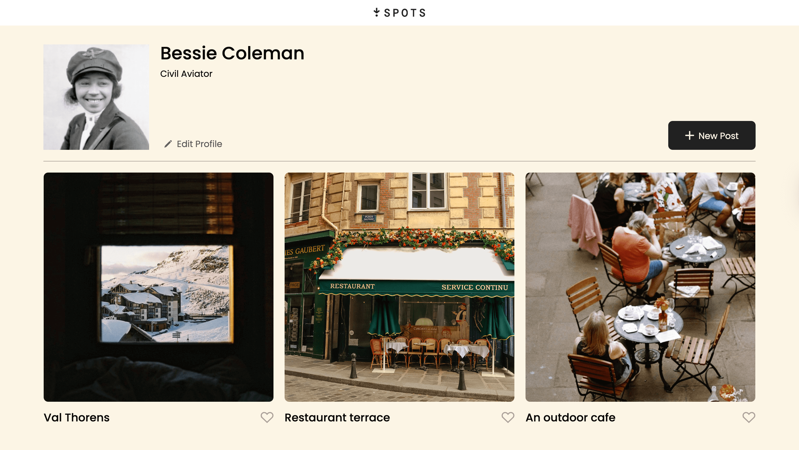
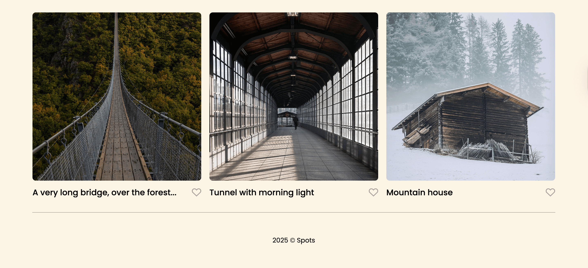

# Spots

A social media/photo sharing site of beautiful scenery experiences.

## Description

The site allows to create a profile with the identity of the user. the profiles shows a gallery three photos per row with a heart icon below each image. It allows users to express and appreciate for the images they like.

## Tech Stack

- HTML
- CSS
- Responsive Design
- CSS Grid
- Media Queries

## Screenshots

## Deployment

This webpage is deployed to GitHub Pages

[Diployment Link](https://nayeliglover.github.io/se_project_spots/)
